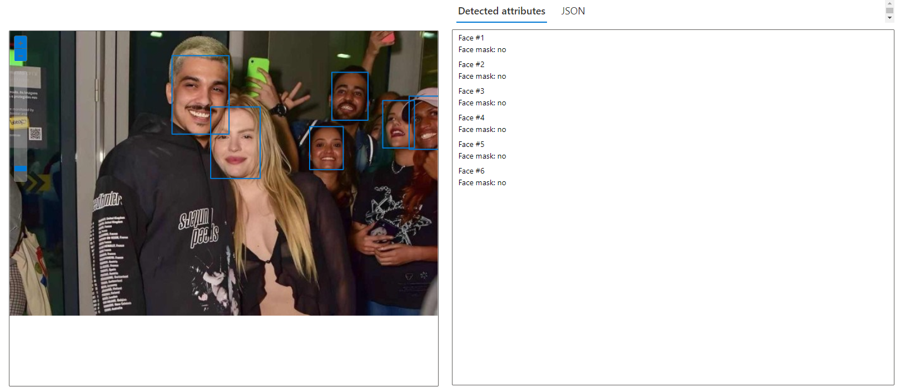

# Análise de imagem no Vision Studio
Nesse projeto vi bastante coisa interessante sobre como a inteligência artificial funciona quando precisamos que detecte os elementos de uma imagem ou quando precisamos detectar os textos de uma imagem. 

Para fazer meus testes, optei por utilizar a imagem de duas pessoas que sou fã, o grand Casimiro e Chico Moedas!

## Testes

### Primeiro teste (legenda)

### Segundo teste (reconhecimento facial)

### Terceiro teste (reconhecimento facial)

## Posssibilidades

### Integração em vídeos
Acho que em breve poderemos ter a descrição do ambiente em tempo real em vídeos no YT e em outros meios para ajudar as pessoas com alguma deficiência visual, acho que seria incrível!